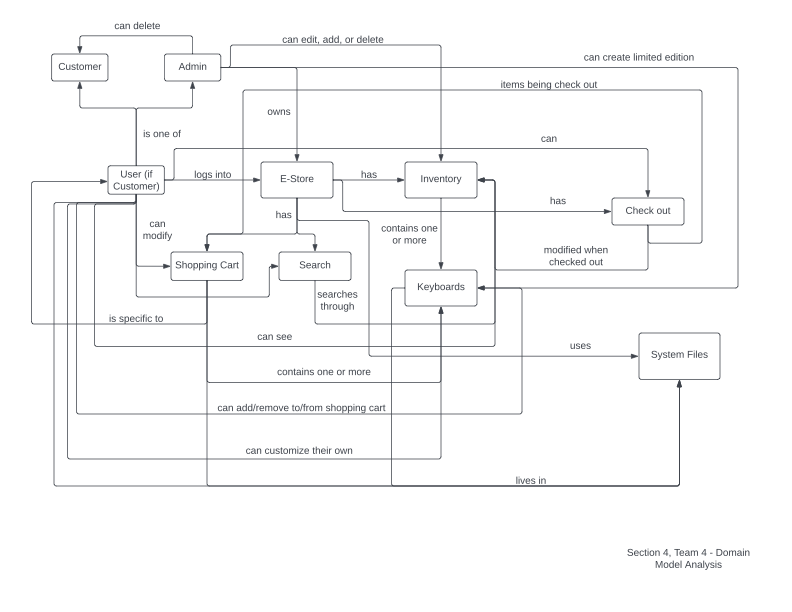
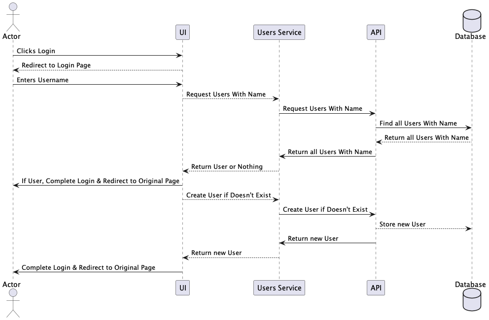
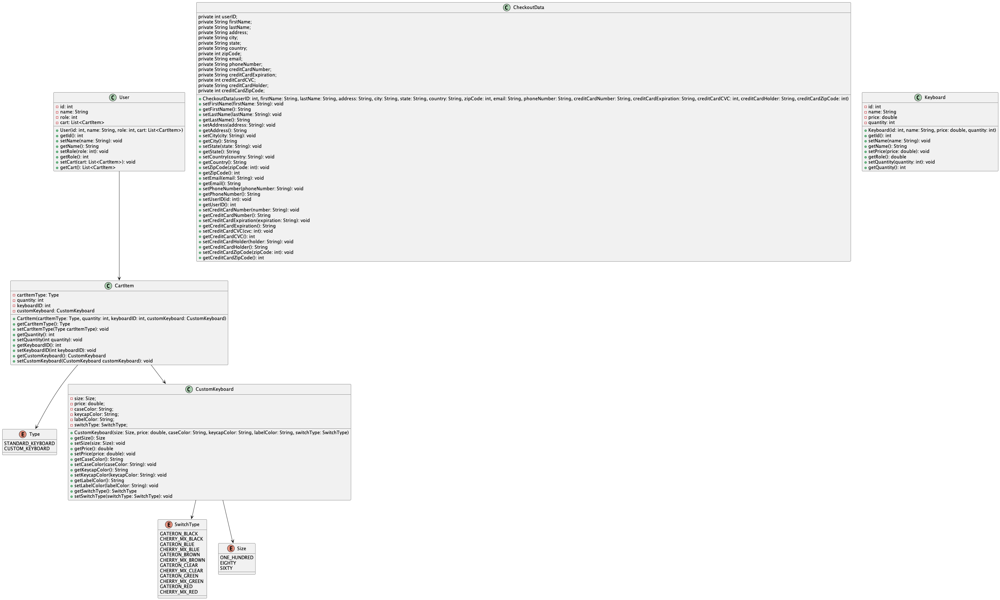

# Mechanical Keyboard EStore Design Documentation

## Team Information
* Team name: SICA
* Team members
  * Siddhartha Juluru
  * Ashlyn King
  * Cathy Liu
  * Issac Kim

## Executive Summary

In multiple, recently published studies, it is expected that the global mechanical keyboard market will experience a growth in revenue that can be measured with double-digit percentages. In order to take advantage of this expected growth, SICA has decided create its own Mechanical Keyboard EStore, opening a gateway between potential consumers and manufacturers.

### Purpose

The Mechanical Keyboard EStore by SICA is designed in a way that it easy to use for both the Customer and the Keyboard Manufacturer. If a Keyboard Manufacturer wishes to list their keyboard on the EStore, all they need to provide us with is the name and the price. Everything else will be handled with SICA. Since this store is intended to help connect new and returning mechanical keyboard fans with products from Mechanical Keyboard Manufacturers, the main user grop is anyone with an interest in keyboards. As such, it was made a priority that the user is able find a product they like and gain enough knowledge about it to see if they want to go ahead with their purchase. Designing the store in a way that is simple to navigate was also made a priority. 

### Glossary and Acronyms

| Term | Definition             |
|------|------------------------|
| SPA  | Single Page            |
| MVP  | Minimal Viable Product |

## Requirements

This section describes the features of the application.

### Definition of MVP

At this point in time, the MVP is defined as following list of features:
- Customer:
  - The customer is able to view all the products available at the store.
  - The customer is able to use the search to filter the products.
  - A customer is able to create a user account, which lets them have a cart 
  associated with them.
  - The customer is able to add/remove from the cart and update product quantity in
  the cart.
  - The customers cart is saved whenever they leave the website and restored when 
  they come back.
- Admin:
  - The admin is able to log into the EStore with a the reserved admin account. 
  - The admin account is able to modify the inventory in any way: add, remove, 
  update products.
  - The admin is unable to have a shopping cart.

### MVP Features

The top-level stories that are associated with the MVP are as follows:
- Add Admin Login (13)
- Add Product Inventory Manipulation (8)
- Search for Products (5)
- Add Shopping Cart (13)
- Add Customer Login (13)

### Roadmap of Enhancements

A list of possible enhancements that may be added to the product are as follows:
- Ability for the Customer To Customize a Keyboard
- Ability to Have Limited Time (Seasonal) Products.
- Ability for Customers to Leave Reviewes
- Ability for the Admin to View All Placed Orders
- Password Authentication to User Account
- Ability to View Cart without Navigating Away
- User Account Customiziation
- ...

While there are many possible enhancements, they are currently listed in their order of consieration and may or may not be added to the final product.

## Application Domain

This section describes the application domain.

From the diagram above, it becomes somewhat clear on the exact roles of the admin and the customer are in relation to the entire application. The customer and the admin can log into the EStore, however their roles are vastly different. The Customer is allowed to browser products, add it to their cart, and finally checkout when done. The customer is not allowed to modify the products and the inventory in any way (except by purchasing). On the other hand, the Admin can edit all products and manage the inventory, however they are not allowed to use a shopping cart and checkout.

## Architecture and Design

This section describes the application architecture.

### Summary

The following Tiers/Layers model shows a high-level view of the webapp's architecture.

The e-store web application, is built using the Model–View–ViewModel (MVVM) architecture pattern. 

The Model stores the application data objects including any functionality to provide persistance. 

The View is the client-side SPA built with Angular utilizing HTML, CSS and TypeScript. The ViewModel provides RESTful APIs to the client (View) as well as any logic required to manipulate the data objects from the Model.

Both the ViewModel and Model are built using Java and Spring Framework. Details of the components within these tiers are supplied below.

### Overview of User Interface

When the website first loads, the screen contains a navigation bar and a list of all the products that are available at the store. The list of products contains multiple product cards. Each product card has an image, the product name, product price, and a button to add to cart. If the card is clicked, it goes to the product detail page which displays more information and allows the item to be added to the cart in bulk (changing the quantity). The navigation bar contains the name of the store (which is also a link back to the home page), the search bar, and a login button. The search bar is linked to the list of all products at the store, and when text is typed in, the products are filtered based on the text. The login button takes the user to a login page which asks them to input their username. If the username doesn't exist, an account is created. Once logged in, the add cart button will now work. If the add cart button is clicked before logging in, we are redirected to the login, then brought back. Once logged in, the login button on the navigation bar changes to 'Logout' and a 'Cart' button appears. When clicked the cart button, we are redirected to a page that shows all the items in the cart and allows them to be deleted and their quantity to be manipulated.

### View Tier

The View Tier UI has a lot of components that allows for it to work efficiently. The first component is the client component which hosts to intial UI. The client component uses the navbar component, editor component, and the product-list component. The navbar component contains the search component which is responsible for taking in user input and passing it around and two buttons: cart and login. The login button redirects to the login component which allows the user to either sign in or create an account. Once logged in, the cart button can be clicked which redirects to the cart component which displays the users cart. The cart component uses the cart-item component which shows information about each product in the cart. This component uses the quantity component which displays the product quantity. The editor component only gets displayed when the logged in user is an admin and allows for the editing of inventory items. The product list component contains the product component which displays an image of the product, the product name, product price, and an add-to-cart button which only works when the user is logged in. When the product component is clicked, it navigates to the product detail component which shows extended information about the product. This component also uses the quantity and add-to-cart component.   

An example of how the login works is shown in the following sequence diagram:

### ViewModel Tier

In the ViewModel Tier, we can see from the diagram that the tier is made up of the DAO and the Controllers. The DAOs server as the interface between the code and the file storage for the Controllers. Since each DAO has similar methods, a GeneralDAO interface is provided so that the DAO classes can extend it. Each controller has its own DAO which it relies on, but may rely on other DAOs if data is needed from them.

### Model Tier

From the Model Tier Diagram, we can see that there is an indirect relationship between the two classes listed. The User classes has an indirect relationship to the Keyboard class by storing the ID of the keyboard inside the User's cart. This is done to reduce the storage footprint of the User class when written to a file.

### Static Code Analysis/Design Improvements
> _Discuss design improvements that you would make if the project were
> to continue. These improvement should be based on your direct
> analysis of where there are problems in the code base which could be
> addressed with design changes, and describe those suggested design
> improvements._

> _With the results from the Static Code Analysis exercise, 
> discuss the resulting issues/metrics measurements along with your analysis
> and recommendations for further improvements. Where relevant, include 
> screenshots from the tool and/or corresponding source code that was flagged._

## Testing
> _This section will provide information about the testing performed
> and the results of the testing._

### Acceptance Testing
> _Report on the number of user stories that have passed all their
> acceptance criteria tests, the number that have some acceptance
> criteria tests failing, and the number of user stories that
> have not had any testing yet. Highlight the issues found during
> acceptance testing and if there are any concerns._

### Unit Testing and Code Coverage
> _Discuss your unit testing strategy. Report on the code coverage
> achieved from unit testing of the code base. Discuss the team's
> coverage targets, why you selected those values, and how well your
> code coverage met your targets. If there are any anomalies, discuss
> those._
