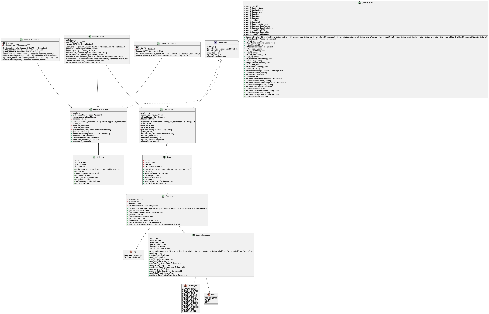

# Mechanical Keyboard EStore Design Documentation

## Team Information
* Team name: SICA
* Team members
  * Siddhartha Juluru
  * Ashlyn King
  * Cathy Liu
  * Issac Kim

## Executive Summary

In multiple, recently published studies, it is expected that the global mechanical keyboard market will experience a growth in revenue that can be measured with double-digit percentages. In order to take advantage of this expected growth, SICA has decided create its own Mechanical Keyboard EStore, opening a gateway between potential consumers and manufacturers.

### Purpose

The Mechanical Keyboard EStore by SICA is designed in a way that it easy to use for both the Customer and the Keyboard Manufacturer. If a Keyboard Manufacturer wishes to list their keyboard on the EStore, all they need to provide us with is the name and the price. Everything else will be handled with SICA. Since this store is intended to help connect new and returning mechanical keyboard fans with products from Mechanical Keyboard Manufacturers, the main user grop is anyone with an interest in keyboards. As such, it was made a priority that the user is able find a product they like and gain enough knowledge about it to see if they want to go ahead with their purchase. Designing the store in a way that is simple to navigate was also made a priority. 

### Glossary and Acronyms

| Term | Definition                 |
|------|----------------------------|
| SPA  | Single Page                |
| MVP  | Minimal Viable Product     |
| DAO  | Data Access Object         |
| JSON | Javascript Object Notation |

## Requirements

This section describes all the features of the application.

### Definition of MVP

The MVP is defined as following list of features:

- **Customer**:
  - The customer is able to view all the products available at the store.
  - The customer is able to use the search to filter the products.
  - A customer is able to create a user account, which lets them have a cart 
  associated with them.
  - The customer is able to add/remove from the cart and update product quantity in
  the cart.
  - The customers cart is saved whenever they leave the website and restored when 
  they come back.
- **Admin**:
  - The admin is able to log into the EStore with a the reserved admin account. 
  - The admin account is able to modify the inventory in any way: add, remove, 
  update products.
  - The admin is unable to have a shopping cart.

### MVP Features

The top-level stories that are associated with the MVP are as follows:

- **Create New Product**
  - As a Developer I want to submit a request to create a new product (name, price, quantity) so that it is available to in the inventory.
- **Get a Single Product**
  - As a Developer I want to submit a request to get a single product so that I can access the price and quantity.
- **Delete a Single Product**
  - As a Developer I want to submit a request to delete a single product so that it is no longer in the inventory.
- **Get Products by Name**
  - As a Developer I want to submit a request to get products by name so that I can see all products that share a similar name.
- **Get Entire Inventory**
  - As a Developer I want to submit a request to get the entire inventory so that I have access to all of the products.
- **Update a Product**
  - As a Developer I want to submit a request to get the entire inventory so that I have access to all products and their details.
- **Add Admin Login**
  - As a owner I want to add a admin login so that I have access to manipulate products.
- **Add Product Inventory Manipulation**
  - As a owner, I want a product inventory so that I can add, remove, and edit the product data in the inventory.
- **Search for Products**
  - As a User I want to submit a request to get the products in the inventory whose name contains the given text so that I have access to only those products.
- **Add Shopping Cart**
  - As a user, I want a shopping cart so that I can keep track of items I want to buy.
- **Add Customer Login**
  - As a customer I want to have a login so that I can save and buy my products.
- **Add Description to Keyboard**
  - As a customer I want to be able to see the description so that I can know if the keyboard is something I would like to invest in.
- **Add the Ability to Checkout**
  - As a customer, I want the ability to checkout, so that I can purchase my products.
- **10%: Keycaps**
  - As a customer I want to pick out my keycaps so that I can build my desired keyboard
- **10%: Switches**
  - As a customer I want to pick out my switches so that I can build my desired keyboard.
- **10%: Keyboard Case**
  - As a customer I want to pick out my keyboard case so that I can build my desired keyboard.
- **10%: Keyboard Size**
  - As a customer I want to pick out my keyboard size so that I can build my desired keyboard.
- **10%: Add Keyboard Customizer**
  - As a customer, I want to be able to customize my keyboard so that I can design it to my preferences.

### Roadmap of Enhancements

A list of possible enhancements that may be added to the product are as follows:

- Ability to View Cart without Navigating Away
- Password Authentication to User Account
- Ability to Have Limited Time (Seasonal) Products.
- Ability for the Admin to View All Placed Orders
- User Account Customiziation

All of these enhancements are listed in the amount of work required for each with the top being trivial and the bottom be difficult.

## Application Domain

This section describes the application domain.

From the diagram above, it becomes somewhat clear on the exact roles of the admin and the customer are in relation to the entire application. The customer and the admin can log into the EStore, however their roles are vastly different. The Customer is allowed to browser products, add it to their cart, and finally checkout when done. The customer is not allowed to modify the products and the inventory in any way (except by purchasing). On the other hand, the Admin can edit all products and manage the inventory, however they are not allowed to use a shopping cart and checkout.

## Architecture and Design

This section describes the application architecture.

### Summary

The following Tiers/Layers model shows a high-level view of the webapp's architecture.

The e-store web application, is built using the Model–View–ViewModel (MVVM) architecture pattern. 

The Model stores the application data objects including any functionality to provide persistance. 

The View is the client-side SPA built with Angular utilizing HTML, CSS and TypeScript. The ViewModel provides RESTful APIs to the client (View) as well as any logic required to manipulate the data objects from the Model.

Both the ViewModel and Model are built using Java and Spring Framework. Details of the components within these tiers are supplied below.

### Overview of User Interface

list of all the products available at the store. The list of products contains multiple product cards. Each product card has an image, the product name, the price, and a button to add to the cart. When clicked, the card goes to the product detail page, which displays more information and allows the item to be added to the cart in bulk (changing the quantity). Along with all the available products, a special card will enable you to customize your keyboard. This page lets you pick the size, color, and switch type for your keyboard with an interactive keyboard visualizer. Once designed, the customer can add the keyboard to their cart. The navigation bar contains the store's name (which, when clicked, is a link back to the home page), the search bar, and a login button. Linked to the list of all products (shown on the homepage) is a search bar, which, when typed in, filters all the products based on the current query. The login button takes the user to a login page which asks them to input their username. An account is created if the username is currently unused. Once logged in, the add cart button will now work. If the add cart button is clicked before logging in, the customer is redirected to the login, then brought back to their original page. Once logged in, the login button on the navigation bar changes to 'Logout,' and a 'Cart' button appears. When the cart button is clicked, the customer is redirected to a page that shows all the items in the cart and allows them to be deleted and their quantity to be manipulated. Along with providing user actions, the cart page also contains a checkout button displayed if purchasable items are in the cart. Here, purchasable items are defined as the cart items being in stock or if the cart item is a custom keyboard. At least one of these conditions must be partially true for the button to appear. Suppose the first condition (cart items being in stock) isn't fully met, meaning that one item is purchasable and the other isn't. In that case, a notification will appear telling the customer that they can only purchase a subset of their items. When clicked, the checkout button redirects the customer to a page that shows the items being purchased, the total price, and two forms: one for delivery information and the other for payment information. If there are errors in either form, they are displayed, and proceeding with checkout is blocked until they are fixed. When everything is valid, completing checkout will redirect the user to an order success page, remove the items from their cart, and redirect them back to the home page.

### View Tier

The View Tier has a lot of components, all of which are necessary for the product to work efficiently. Due to the components narrowed focus and high usage, it is best to describe these components in a bulleted list, with small descriptions next to them.

- **Add to Cart Component**: The add to cart component integrates all the logic that is performed when a product is added to cart. The reuse of this logic led to a seperate component being created.
- **Cart Component**: The cart component contains the user interface for the cart page. It integrates the cart item component to display each item in the cart. This page also has the logic which decides if the checkout button should be shown.
- **Cart Item Component**: The cart item component contains the layout for each individual cart item. This includes all the product info, the **Quantity Selector Component**, the total price, and a delete button.
- **Checkout Component**: The checkout component contains the user interface for the checkout page. It integrates the checkout item component for displaying the current products being bought. The component also has the delivery and payment information forms, both of which were discussed earlier.
- **Checkout Item Component**: The checkout item component is a smaller, more compact version of the cart item component. It is meant to provide just enough information about what is being bought. It does not contain the **Quantity Selector Component**.
- **Checkout Success Component**: The checkout success component is the page that is display after checkout is completed. The only logic that this page contains is the logic that redirects the user back to the home page. Other than that, this component is entirely HTML & CSS.
- **Client Component**: The client component is the main page that is displayed when the website is visited. If the current user is a regular user, the client component only displays the **Keyboard List Component**. If the user is an admin, the **Editor Compoennt** is displayed above the list component. This only logic this component contains is checking the current role of the user.
- **Editor Component**: The editor component is the only component that is specific to the admin. This component is used to add new products or edit the information in a current product. When used for editing, the component works hand-in-hand with the **Keyboard Component**, pulling all its information when one is clicked.
- **Keyboard Component**: The keyboard component is used for displaying the cards that are shown on the home page. This card contains all the essential information about a product besides its description. It also integrates the **Add To Cart Component** for purchasing. This component is not meant to be displayed by itself but inside the **Keyboard List Component**. A special version of this card exists to link to the **Keyboard Configurator Component**.
- **Keyboard Detail Component**: The keyboard detail component is a page that displays the same information shown in the **Keyboard Component**, the description of the keyboard, and the **Quantity Selector Component**. This component lays out the information in a much bigger area, allowing for customers to not only gain more information about the product, but also allowing for bulk adding of the product via the **Quantity Selector Component**.
- **Keyboard List Component**: The keyboard list component is displayed on the home screen and contains one product card for each product in the inventory. The keyboard list component lays out all the products in a grid fashion.
- **Keyboard Configurator Component**: The keyboard configurator component is a separate page that allows for the creation of a custom keyboard. The page contains an interactive keyboard that dynamically changes its color based on the colors that the customer selects. The page also has a drop down that allows for the changing of switches on the keyboard. Once created the user can add the keyboard to the cart.
- **Login Component**: The login component is separate page that allows for the user to sign into the website. The only inputs on this page is a textbox and a button that signs in. When submitted, the user is either created/retrieved and the user is redirected to the home page.
- **Navbar Component**: The navbar component is used to show quick actions at the top of the page. The component is displayed on nearly every page except the login page and the checkout success page.
- **Message Popup Component**: The message popup component is used for displying small error messages to the user. In places where a full error message isn't applicable or can be properly fit into the UI, the popup component is used.
- **Quantity Selector Component**: The quantity selector component provides a user friendly way to select the quantity of a product that the user plans to purchase. The component allows for the quantity to be increased/decreased one at a time or by a larger amount if the user uses the drop down menu.
- **Search Component**: The search component displays a search box that is linked to the **Keyboard List Component**. The search component lives in the **Navbar Component** and is only displayed on the home page since that is the only place where it is applicable.
- **Segmented Control Component**: The segmented control component is used on the **Keyboard Configurator Component** to select the different sizes available. The data of the component can be dynamically changed for use in other places if required.

Along with the components, there are also some services which are important to the View Tier:

- **User Service**: The user service contains all the logic used for getting all users, logging in/out, and adding/removing to/from a user's cart.
- **Keyboard Service**: The keyboard service contains all the logic used for getting, adding, updating, and deleting keyboards. 
- **Checkout Service**: The checkout service contains all the logic used to complete checkout for a specific user.
- **Notification Service**: The notification service contains all the logic for posting notifications to the entire app. It is used in components where passing events upward creates unecessary complexity.

Two sequence diagrams are shown below, each showing core functionality of the EStore and the role of that the services described above.

### Add To Cart Sequence Diagram
\begin{center}
  \includegraphics[width=0.65\textwidth]{./Add_To_Cart_Sequence_Diagram.png}
\end{center}

### Checkout Sequence Diagram
\begin{center}
  \includegraphics[width=0.7\textwidth]{./Checkout_Sequence_Diagram.png}
\end{center}

### ViewModel Tier

From the diagram above, we can see that the ViewModel tier is made up of Rest Controllers and DAOs. The Rest Controllers define specific routes on the API side for functionality while the DAOs help interface with the JSON files used for storing data. Due to the design of the API, there are only three controllers defined: 

- **UserController**: Defines all the routes allowing for the creation/deletion/modification of a user.
- **KeyboardController**: Defines all the routes allowing for the creation/deletion/modification of a keyboard.
- **CheckoutController**: Defines the route that is used for user checkout.

All of the controllers take advantage of at least one of the two DAOs available: 

- **UserFileDAO**: The user file DAO allows for the editing of the `users.json` file which contains the list of all the users registered with the store.
- **KeyboardFileDAO**: The keyboard file DAO allows for the editing of the `keyboards.json` file which contains the list of all the created keyboards with the store.

Each Controller and DAOs depenency can be seen in the above diagram.

\pagebreak
### Model Tier

From the diagram above, we can see that the Model Tier is composed of five different models:

- **CartItem**: The CartItem model is used to represents what is currently in the user cart. It contains the current type of the item, its quantity, and either a link to the keyboard ID or the custom keyboard it represents.
- **CheckoutData**: The CheckoutData model is used to represents all the information that is gathered when the user successfully checks out. It contains a reference to the user who is checking out and all the information they inputted.
- **CustomKeyboard**: The CustomKeyboard model is used to represent the custom keyboard that was designed on the View Tier side.
- **Keyboard**: The Keyboard model is used to represent a keyboard that is currently listed for sale on the EStore. 
- **User**: The User model is used to represent a user that is currently registered with the EStore. The User model has a cart field which is a list of CartItem models.

### Static Code Analysis/Design Improvements

Though SICA's goal is to write clean, safe, and reusable code, it was inevitable that a project this big is to have some bugs that slip through the cracks as shown below. 

\begin{center}
  \includegraphics[]{./SonarQube_Project_List.png}
\end{center}

A quick analysis of the bugs found by SonarQube, we found that the bugs were not entirely code related, but were in fact accessibility related (which are still important). 

\begin{center}
  \includegraphics[]{./SonarQube_EStore_API_Bugs.png}
\end{center}

Specifically, the bugs related to the missing of HTML accessiblity tags. Accessbility tags in HTML are used to ensure that users who rely on screenreaders can have the same experience as those who don't. While the fixing of these bugs is a quick (~5 minutes combined), they were unforunately found at a time where they could not be prioritized.

Along with those two bugs, there were significant, non-usability affecting, code smells that occured. On the EStore UI side, most of the code smells related to the existence of unused imports in code files. During Sprint 3, the UI went through major refactoring which resulted in a lot of imports which used to be required no longer being needed. As the priority was to get a working product, these "code smells" went under the radar until after development ended. On the EStore API side, the code smells related irrelevant visibility modifies (public/private/etc..), unnecessarily complex tests (3 tests for something that can be done in 1), missed code simplification, and code that is too cognitively heavy. An example of unnecessarily complex tests can be seen below.

\begin{center}
  \includegraphics[]{./Complex_Tests_Case.png}
\end{center}

These were again unfortunately found after development for Sprint 3 had ended.

Looking into the future, there are many things that we would like to implement if we had more time. Two of the most important would be password authentication and the ability for an admin to view all the orders. Password authentication is important as it prevents person A from randomly access Person B's account by guessing their username. Allowing an admin to view all orders is also important as it can help an admin see how their store is performing. Improvement to the custom keyboard configurator would also be made. At the moment, all the keycaps must be the same color which, while adaquete, may not appeal to all users. A more customizable keyboard that allows each keycap to be a different color may be more attractive for potential buyers.

## Testing

### Acceptance Testing

In order to properly implement the MVP and the corresponding 10% feature, a total of 18 user stories were created. Out of these, all 18/18 passed their acceptance tests with none failing. During cross-team testing, there were a total of 13 user stories implemented, with the last 5 being implemented later. Out of the 13 user stories testing through cross-team testing, all 13 passed their acceptance tests. The passing of all the acceptance tests on the first try was a primary goal of SICA's and we are proud to have met it.

### Unit Testing and Code Coverage

As SICA prides itself on writing clean, safe, and reusable code, we made it a requirement that we reached 100% code coverage on all of our Unit Tests. From the images provide below, it can be seen that SICA has been able to achieve this goal.

\pagebreak
**Controller Tier Tests**:
\begin{center}
  \includegraphics[]{./Controller_Tier_Tests.png}
\end{center}

**Model Tier Tests**:
\begin{center}
  \includegraphics[]{./Model_Tier_Tests.png}
\end{center}

**Persistence Tier Tests**:
\begin{center}
  \includegraphics[]{./Persistence_Tier_Tests.png}
\end{center}